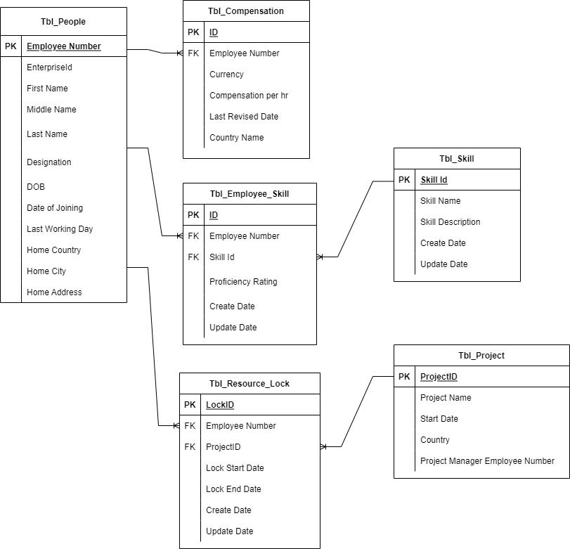

# Resource-Allocation-System-RDBMS
Masters project to create end-to-end industry-ready RDBMS Solution for optimizing workforce allocation

# Resource Allocation System

This Masters project creates an end-to-end industry-ready RDBMS Solution for optimizing workforce allocation in professional services organizations.

## Project Overview
- Developed for IMT 543 B under Professor Chintan Thakkar
- Implemented on SQL Server (IS-HAY09.iSchool.uw.edu)
- Database: IMT_PROJ_2122992

## Key Features
- Employee-Project matching based on skills
- Resource locking mechanism
- Compensation and project budget alignment

## Entity Relationship Diagrams
### Draft ERD

### Revised ERD

## Technical Highlights
- Implemented one-to-one and one-to-many relationships
- Created stored procedures with error handling
- Developed user-defined functions
- Applied business rules using constraints

## Detailed Documentation
For full project details, please refer to the [presentation](Resource-Allocation-System.pptx).
